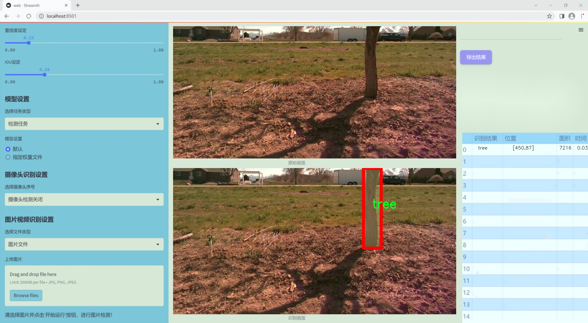

### 1.背景意义

### 研究背景与意义

随着城市化进程的加快，树木作为城市生态系统的重要组成部分，其健康状况和分布情况对城市环境的可持续发展具有重要影响。树木的实例分割技术，尤其是在计算机视觉领域，已成为研究和管理城市绿化的重要工具。传统的树木监测方法往往依赖人工调查，效率低下且容易受到人为因素的影响。因此，基于深度学习的自动化树木实例分割系统的开发显得尤为必要。

本研究旨在基于改进的YOLOv11模型，构建一个高效的树木实例分割系统。该系统将利用一个包含1500张图像的专用数据集，专注于树木这一单一类别的实例分割。通过对数据集的精细标注和模型的优化训练，我们期望能够实现对树木的精准识别与分割。这不仅能够提高树木监测的效率，还能为城市规划、生态评估和环境保护提供科学依据。

此外，树木实例分割技术的应用前景广泛。在城市绿化管理中，能够快速、准确地识别树木位置和健康状况，有助于制定合理的养护方案；在生态研究中，分析树木的分布和生长趋势，有助于理解生态系统的动态变化。因此，开发一个基于YOLOv11的树木实例分割系统，不仅具有重要的学术价值，也为实际应用提供了切实可行的解决方案。

综上所述，本研究的开展将推动树木监测技术的发展，为实现智能化的城市绿化管理提供有力支持，具有重要的理论意义和实际应用价值。通过不断优化模型和算法，我们期望能够为未来的城市生态环境保护贡献一份力量。

### 2.视频效果

[2.1 视频效果](https://www.bilibili.com/video/BV1gEk9YUExG/)

### 3.图片效果




##### [项目涉及的源码数据来源链接](https://kdocs.cn/l/cszuIiCKVNis)**

注意：本项目提供训练的数据集和训练教程,由于版本持续更新,暂不提供权重文件（best.pt）,请按照6.训练教程进行训练后实现上图演示的效果。

### 4.数据集信息

##### 4.1 本项目数据集类别数＆类别名

nc: 1
names: ['tree']


该项目为【图像分割】数据集，请在【训练教程和Web端加载模型教程（第三步）】这一步的时候按照【图像分割】部分的教程来训练

##### 4.2 本项目数据集信息介绍

本项目数据集信息介绍

本项目旨在改进YOLOv11的树木实例分割系统，所使用的数据集专注于“树干分割”（Trunk segmentation）这一主题。该数据集包含了丰富的树木图像，专门用于训练模型以实现高效、准确的树干识别与分割。数据集中仅包含一个类别，即“树”（tree），这使得模型在训练过程中能够专注于树干的特征提取与学习，避免了多类别间的干扰。

在数据集的构建过程中，选取了多种不同环境下的树木图像，涵盖了城市公园、森林、山地等多样化的自然场景。这些图像不仅包含了不同种类的树木，还考虑了不同的光照条件、天气变化以及树木的生长状态，从而确保数据集的多样性和代表性。此外，数据集中的图像经过精心标注，确保每个树干的轮廓清晰可见，为模型的训练提供了高质量的标注数据。

为了增强模型的泛化能力，数据集还包括了一些经过数据增强处理的图像，例如旋转、缩放、裁剪和颜色调整等。这些处理手段旨在模拟现实世界中可能遇到的各种情况，使得训练出的模型能够在实际应用中表现出色。

总之，本项目的数据集为改进YOLOv11的树木实例分割系统提供了坚实的基础，专注于树干这一单一类别的训练，结合多样化的环境和条件，力求实现高效、准确的树木实例分割，推动相关领域的研究与应用发展。


### 5.全套项目环境部署视频教程（零基础手把手教学）

[5.1 所需软件PyCharm和Anaconda安装教程（第一步）](https://www.bilibili.com/video/BV1BoC1YCEKi/?spm_id_from=333.999.0.0&vd_source=bc9aec86d164b67a7004b996143742dc)


[5.2 安装Python虚拟环境创建和依赖库安装视频教程（第二步）](https://www.bilibili.com/video/BV1ZoC1YCEBw?spm_id_from=333.788.videopod.sections&vd_source=bc9aec86d164b67a7004b996143742dc)

### 6.改进YOLOv11训练教程和Web_UI前端加载模型教程（零基础手把手教学）

[6.1 改进YOLOv11训练教程和Web_UI前端加载模型教程（第三步）](https://www.bilibili.com/video/BV1BoC1YCEhR?spm_id_from=333.788.videopod.sections&vd_source=bc9aec86d164b67a7004b996143742dc)


按照上面的训练视频教程链接加载项目提供的数据集，运行train.py即可开始训练



     Epoch   gpu_mem       box       obj       cls    labels  img_size
     1/200     20.8G   0.01576   0.01955  0.007536        22      1280: 100%|██████████| 849/849 [14:42<00:00,  1.04s/it]
               Class     Images     Labels          P          R     mAP@.5 mAP@.5:.95: 100%|██████████| 213/213 [01:14<00:00,  2.87it/s]
                 all       3395      17314      0.994      0.957      0.0957      0.0843

     Epoch   gpu_mem       box       obj       cls    labels  img_size
     2/200     20.8G   0.01578   0.01923  0.007006        22      1280: 100%|██████████| 849/849 [14:44<00:00,  1.04s/it]
               Class     Images     Labels          P          R     mAP@.5 mAP@.5:.95: 100%|██████████| 213/213 [01:12<00:00,  2.95it/s]
                 all       3395      17314      0.996      0.956      0.0957      0.0845

     Epoch   gpu_mem       box       obj       cls    labels  img_size
     3/200     20.8G   0.01561    0.0191  0.006895        27      1280: 100%|██████████| 849/849 [10:56<00:00,  1.29it/s]
               Class     Images     Labels          P          R     mAP@.5 mAP@.5:.95: 100%|███████   | 187/213 [00:52<00:00,  4.04it/s]
                 all       3395      17314      0.996      0.957      0.0957      0.0845


###### [项目数据集下载链接](https://kdocs.cn/l/cszuIiCKVNis)

### 7.原始YOLOv11算法讲解


##### YOLO11介绍

Ultralytics YOLO11是一款尖端的、最先进的模型，它在之前YOLO版本成功的基础上进行了构建，并引入了新功能和改进，以进一步提升性能和灵活性。
**YOLO11设计快速、准确且易于使用，使其成为各种物体检测和跟踪、实例分割、图像分类以及姿态估计任务的绝佳选择。**


**结构图如下：**


##### **C3k2**

**C3k2，结构图如下**


**C3k2，继承自类`C2f，其中通过c3k设置False或者Ture来决定选择使用C3k还是`**Bottleneck


**实现代码** **ultralytics/nn/modules/block.py**

##### C2PSA介绍

**借鉴V10 PSA结构，实现了C2PSA和C2fPSA，最终选择了基于C2的C2PSA（可能涨点更好？）**


**实现代码** **ultralytics/nn/modules/block.py**

##### Detect介绍

**分类检测头引入了DWConv（更加轻量级，为后续二次创新提供了改进点），结构图如下（和V8的区别）：**


### 8.200+种全套改进YOLOV11创新点原理讲解

#### 8.1 200+种全套改进YOLOV11创新点原理讲解大全

由于篇幅限制，每个创新点的具体原理讲解就不全部展开，具体见下列网址中的改进模块对应项目的技术原理博客网址【Blog】（创新点均为模块化搭建，原理适配YOLOv5~YOLOv11等各种版本）

[改进模块技术原理博客【Blog】网址链接](https://gitee.com/qunmasj/good)


#### 8.2 精选部分改进YOLOV11创新点原理讲解

###### 这里节选部分改进创新点展开原理讲解(完整的改进原理见上图和[改进模块技术原理博客链接](https://gitee.com/qunmasj/good)【如果此小节的图加载失败可以通过CSDN或者Github搜索该博客的标题访问原始博客，原始博客图片显示正常】

### Gold-YOLO


#### Preliminaries
YOLO系列的中间层结构采用了传统的FPN结构，其中包含多个分支用于多尺度特征融合。然而，它只充分融合来自相邻级别的特征，对于其他层次的信息只能间接地进行“递归”获取。

传统的FPN结构在信息传输过程中存在丢失大量信息的问题。这是因为层之间的信息交互仅限于中间层选择的信息，未被选择的信息在传输过程中被丢弃。这种情况导致某个Level的信息只能充分辅助相邻层，而对其他全局层的帮助较弱。因此，整体上信息融合的有效性可能受到限制。
为了避免在传输过程中丢失信息，本文采用了一种新颖的“聚集和分发”机制（GD），放弃了原始的递归方法。该机制使用一个统一的模块来收集和融合所有Level的信息，并将其分发到不同的Level。通过这种方式，作者不仅避免了传统FPN结构固有的信息丢失问题，还增强了中间层的部分信息融合能力，而且并没有显著增加延迟。


#### 低阶聚合和分发分支 Low-stage gather-and-distribute branch
从主干网络中选择输出的B2、B3、B4、B5特征进行融合，以获取保留小目标信息的高分辨率特征。


#### 高阶聚合和分发分支 High-stage gather-and-distribute branch
高级全局特征对齐模块（High-GD）将由低级全局特征对齐模块（Low-GD）生成的特征{P3, P4, P5}进行融合。


Transformer融合模块由多个堆叠的transformer组成，transformer块的数量为L。每个transformer块包括一个多头注意力块、一个前馈网络（FFN）和残差连接。采用与LeViT相同的设置来配置多头注意力块，使用16个通道作为键K和查询Q的头维度，32个通道作为值V的头维度。为了加速推理过程，将层归一化操作替换为批归一化，并将所有的GELU激活函数替换为ReLU。为了增强变换器块的局部连接，在两个1x1卷积层之间添加了一个深度卷积层。同时，将FFN的扩展因子设置为2，以在速度和计算成本之间取得平衡。


信息注入模块(Information injection module)： 高级全局特征对齐模块（High-GD）中的信息注入模块与低级全局特征对齐模块（Low-GD）中的相同。在高级阶段，局部特征（Flocal）等于Pi，因此公式如下所示：


#### 增强的跨层信息流动 Enhanced cross-layer information flow
为了进一步提升性能，从YOLOv6 中的PAFPN模块中得到启发，引入了Inject-LAF模块。该模块是注入模块的增强版，包括了一个轻量级相邻层融合（LAF）模块，该模块被添加到注入模块的输入位置。为了在速度和准确性之间取得平衡，设计了两个LAF模型：LAF低级模型和LAF高级模型，分别用于低级注入（合并相邻两层的特征）和高级注入（合并相邻一层的特征）。它们的结构如图5(b)所示。为了确保来自不同层级的特征图与目标大小对齐，在实现中的两个LAF模型仅使用了三个操作符：双线性插值（上采样过小的特征）、平均池化（下采样过大的特征）和1x1卷积（调整与目标通道不同的特征）。模型中的LAF模块与信息注入模块的结合有效地平衡了准确性和速度之间的关系。通过使用简化的操作，能够增加不同层级之间的信息流路径数量，从而提高性能而不显著增加延迟。


### 9.系统功能展示

图9.1.系统支持检测结果表格显示

  图9.2.系统支持置信度和IOU阈值手动调节

  图9.3.系统支持自定义加载权重文件best.pt(需要你通过步骤5中训练获得)

  图9.4.系统支持摄像头实时识别

  图9.5.系统支持图片识别

  图9.6.系统支持视频识别

  图9.7.系统支持识别结果文件自动保存

  图9.8.系统支持Excel导出检测结果数据


### 10. YOLOv11核心改进源码讲解

#### 10.1 lsknet.py

以下是对给定代码的核心部分进行分析和注释的结果：

```python
import torch
import torch.nn as nn
from torch.nn.modules.utils import _pair as to_2tuple
from timm.layers import DropPath, to_2tuple
from functools import partial
import numpy as np

# 定义一个多层感知机（MLP）模块
class Mlp(nn.Module):
    def __init__(self, in_features, hidden_features=None, out_features=None, act_layer=nn.GELU, drop=0.):
        super().__init__()
        out_features = out_features or in_features  # 输出特征数
        hidden_features = hidden_features or in_features  # 隐藏层特征数
        self.fc1 = nn.Conv2d(in_features, hidden_features, 1)  # 第一层卷积
        self.dwconv = DWConv(hidden_features)  # 深度卷积
        self.act = act_layer()  # 激活函数
        self.fc2 = nn.Conv2d(hidden_features, out_features, 1)  # 第二层卷积
        self.drop = nn.Dropout(drop)  # Dropout层

    def forward(self, x):
        x = self.fc1(x)  # 通过第一层卷积
        x = self.dwconv(x)  # 通过深度卷积
        x = self.act(x)  # 激活
        x = self.drop(x)  # Dropout
        x = self.fc2(x)  # 通过第二层卷积
        x = self.drop(x)  # Dropout
        return x

# 定义LSK模块
class LSKblock(nn.Module):
    def __init__(self, dim):
        super().__init__()
        self.conv0 = nn.Conv2d(dim, dim, 5, padding=2, groups=dim)  # 深度卷积
        self.conv_spatial = nn.Conv2d(dim, dim, 7, stride=1, padding=9, groups=dim, dilation=3)  # 空间卷积
        self.conv1 = nn.Conv2d(dim, dim//2, 1)  # 1x1卷积
        self.conv2 = nn.Conv2d(dim, dim//2, 1)  # 1x1卷积
        self.conv_squeeze = nn.Conv2d(2, 2, 7, padding=3)  # 压缩卷积
        self.conv = nn.Conv2d(dim//2, dim, 1)  # 1x1卷积

    def forward(self, x):   
        attn1 = self.conv0(x)  # 通过深度卷积
        attn2 = self.conv_spatial(attn1)  # 通过空间卷积

        attn1 = self.conv1(attn1)  # 1x1卷积
        attn2 = self.conv2(attn2)  # 1x1卷积
        
        attn = torch.cat([attn1, attn2], dim=1)  # 拼接
        avg_attn = torch.mean(attn, dim=1, keepdim=True)  # 平均注意力
        max_attn, _ = torch.max(attn, dim=1, keepdim=True)  # 最大注意力
        agg = torch.cat([avg_attn, max_attn], dim=1)  # 拼接平均和最大注意力
        sig = self.conv_squeeze(agg).sigmoid()  # 压缩并激活
        attn = attn1 * sig[:,0,:,:].unsqueeze(1) + attn2 * sig[:,1,:,:].unsqueeze(1)  # 加权
        attn = self.conv(attn)  # 通过卷积
        return x * attn  # 输出加权的输入

# 定义注意力模块
class Attention(nn.Module):
    def __init__(self, d_model):
        super().__init__()
        self.proj_1 = nn.Conv2d(d_model, d_model, 1)  # 1x1卷积
        self.activation = nn.GELU()  # 激活函数
        self.spatial_gating_unit = LSKblock(d_model)  # LSK模块
        self.proj_2 = nn.Conv2d(d_model, d_model, 1)  # 1x1卷积

    def forward(self, x):
        shorcut = x.clone()  # 保留输入
        x = self.proj_1(x)  # 通过第一层卷积
        x = self.activation(x)  # 激活
        x = self.spatial_gating_unit(x)  # 通过LSK模块
        x = self.proj_2(x)  # 通过第二层卷积
        x = x + shorcut  # 残差连接
        return x

# 定义网络的基本块
class Block(nn.Module):
    def __init__(self, dim, mlp_ratio=4., drop=0., drop_path=0., act_layer=nn.GELU, norm_cfg=None):
        super().__init__()
        self.norm1 = nn.BatchNorm2d(dim)  # 归一化层
        self.norm2 = nn.BatchNorm2d(dim)  # 归一化层
        self.attn = Attention(dim)  # 注意力模块
        self.drop_path = DropPath(drop_path) if drop_path > 0. else nn.Identity()  # 随机深度
        mlp_hidden_dim = int(dim * mlp_ratio)  # MLP隐藏层维度
        self.mlp = Mlp(in_features=dim, hidden_features=mlp_hidden_dim, act_layer=act_layer, drop=drop)  # MLP模块
        layer_scale_init_value = 1e-2            
        self.layer_scale_1 = nn.Parameter(layer_scale_init_value * torch.ones((dim)), requires_grad=True)  # 层缩放参数
        self.layer_scale_2 = nn.Parameter(layer_scale_init_value * torch.ones((dim)), requires_grad=True)  # 层缩放参数

    def forward(self, x):
        x = x + self.drop_path(self.layer_scale_1.unsqueeze(-1).unsqueeze(-1) * self.attn(self.norm1(x)))  # 注意力
        x = x + self.drop_path(self.layer_scale_2.unsqueeze(-1).unsqueeze(-1) * self.mlp(self.norm2(x)))  # MLP
        return x

# 定义图像到补丁的嵌入模块
class OverlapPatchEmbed(nn.Module):
    def __init__(self, img_size=224, patch_size=7, stride=4, in_chans=3, embed_dim=768, norm_cfg=None):
        super().__init__()
        patch_size = to_2tuple(patch_size)  # 转换为2元组
        self.proj = nn.Conv2d(in_chans, embed_dim, kernel_size=patch_size, stride=stride,
                              padding=(patch_size[0] // 2, patch_size[1] // 2))  # 卷积嵌入
        self.norm = nn.BatchNorm2d(embed_dim)  # 归一化层

    def forward(self, x):
        x = self.proj(x)  # 通过卷积嵌入
        _, _, H, W = x.shape  # 获取输出形状
        x = self.norm(x)  # 归一化
        return x, H, W  # 返回嵌入和形状

# 定义LSK网络
class LSKNet(nn.Module):
    def __init__(self, img_size=224, in_chans=3, embed_dims=[64, 128, 256, 512],
                mlp_ratios=[8, 8, 4, 4], drop_rate=0., drop_path_rate=0., norm_layer=partial(nn.LayerNorm, eps=1e-6),
                 depths=[3, 4, 6, 3], num_stages=4, 
                 norm_cfg=None):
        super().__init__()
        
        self.depths = depths  # 各阶段深度
        self.num_stages = num_stages  # 阶段数

        # 随机深度衰减规则
        dpr = [x.item() for x in torch.linspace(0, drop_path_rate, sum(depths))]
        cur = 0

        # 构建每个阶段的嵌入和块
        for i in range(num_stages):
            patch_embed = OverlapPatchEmbed(img_size=img_size if i == 0 else img_size // (2 ** (i + 1)),
                                            patch_size=7 if i == 0 else 3,
                                            stride=4 if i == 0 else 2,
                                            in_chans=in_chans if i == 0 else embed_dims[i - 1],
                                            embed_dim=embed_dims[i], norm_cfg=norm_cfg)

            block = nn.ModuleList([Block(
                dim=embed_dims[i], mlp_ratio=mlp_ratios[i], drop=drop_rate, drop_path=dpr[cur + j], norm_cfg=norm_cfg)
                for j in range(depths[i])])  # 创建块
            norm = norm_layer(embed_dims[i])  # 归一化层
            cur += depths[i]

            setattr(self, f"patch_embed{i + 1}", patch_embed)  # 设置嵌入
            setattr(self, f"block{i + 1}", block)  # 设置块
            setattr(self, f"norm{i + 1}", norm)  # 设置归一化层
        
        # 计算通道数
        self.channel = [i.size(1) for i in self.forward(torch.randn(1, 3, 640, 640))]

    def forward(self, x):
        B = x.shape[0]  # 批量大小
        outs = []  # 输出列表
        for i in range(self.num_stages):
            patch_embed = getattr(self, f"patch_embed{i + 1}")  # 获取嵌入
            block = getattr(self, f"block{i + 1}")  # 获取块
            norm = getattr(self, f"norm{i + 1}")  # 获取归一化层
            x, H, W = patch_embed(x)  # 嵌入
            for blk in block:
                x = blk(x)  # 通过块
            x = x.flatten(2).transpose(1, 2)  # 展平并转置
            x = norm(x)  # 归一化
            x = x.reshape(B, H, W, -1).permute(0, 3, 1, 2).contiguous()  # 重新形状
            outs.append(x)  # 添加输出
        return outs  # 返回所有阶段的输出

# 定义深度卷积模块
class DWConv(nn.Module):
    def __init__(self, dim=768):
        super(DWConv, self).__init__()
        self.dwconv = nn.Conv2d(dim, dim, 3, 1, 1, bias=True, groups=dim)  # 深度卷积

    def forward(self, x):
        x = self.dwconv(x)  # 通过深度卷积
        return x

# 更新模型权重
def update_weight(model_dict, weight_dict):
    idx, temp_dict = 0, {}
    for k, v in weight_dict.items():
        if k in model_dict.keys() and np.shape(model_dict[k]) == np.shape(v):
            temp_dict[k] = v  # 更新权重
            idx += 1
    model_dict.update(temp_dict)  # 更新模型字典
    print(f'loading weights... {idx}/{len(model_dict)} items')  # 打印加载信息
    return model_dict

# 定义LSKNet的不同变体
def lsknet_t(weights=''):
    model = LSKNet(embed_dims=[32, 64, 160, 256], depths=[3, 3, 5, 2], drop_rate=0.1, drop_path_rate=0.1)
    if weights:
        model.load_state_dict(update_weight(model.state_dict(), torch.load(weights)['state_dict']))  # 加载权重
    return model

def lsknet_s(weights=''):
    model = LSKNet(embed_dims=[64, 128, 256, 512], depths=[2, 2, 4, 2], drop_rate=0.1, drop_path_rate=0.1)
    if weights:
        model.load_state_dict(update_weight(model.state_dict(), torch.load(weights)['state_dict']))  # 加载权重
    return model

# 主程序入口
if __name__ == '__main__':
    model = lsknet_t('lsk_t_backbone-2ef8a593.pth')  # 实例化模型
    inputs = torch.randn((1, 3, 640, 640))  # 随机输入
    for i in model(inputs):  # 前向传播
        print(i.size())  # 打印输出尺寸
```

### 核心部分分析
1. **Mlp**: 实现了一个多层感知机，包含卷积层、深度卷积、激活函数和Dropout，适用于特征变换。
2. **LSKblock**: 该模块实现了空间注意力机制，结合了深度卷积和压缩卷积，通过加权的方式增强特征表示。
3. **Attention**: 实现了残差连接的注意力机制，使用了前向传播中的卷积和激活函数。
4. **Block**: 结合了注意力和MLP模块，使用BatchNorm和DropPath，形成了网络的基本构建块。
5. **OverlapPatchEmbed**: 实现了图像到补丁的嵌入，使用卷积和归一化，生成特征图。
6. **LSKNet**: 整体网络结构，包含多个阶段，每个阶段都有嵌入、块和归一化层，最终输出特征图。
7. **DWConv**: 实现了深度卷积，用于特征提取。
8. **update_weight**: 更新模型权重的辅助函数，确保权重匹配。
9. **lsknet_t 和 lsknet_s**: 定义了不同的LSKNet变体，并提供了加载预训练权重的功能。

这些核心部分共同构成了一个高效的深度学习模型，适用于图像处理任务。

这个文件定义了一个名为 `lsknet.py` 的深度学习模型，主要用于图像处理任务。它基于 PyTorch 框架构建，包含多个类和函数，具体分析如下。

首先，文件导入了必要的库，包括 PyTorch 和一些辅助模块。接着，定义了一个名为 `Mlp` 的类，它是一个多层感知机（MLP），由两个卷积层和一个深度卷积层（`DWConv`）组成。这个类的构造函数接受输入特征、隐藏特征、输出特征、激活函数和丢弃率作为参数。在前向传播中，输入数据经过一系列卷积、激活和丢弃操作，最终输出结果。

接下来是 `LSKblock` 类，它实现了一种特定的块结构，包含多个卷积层和注意力机制。这个块首先通过深度卷积层和空间卷积层生成两个特征图，然后对这两个特征图进行处理，得到注意力权重，并将其应用于输入特征上，最终输出加权后的特征。

`Attention` 类实现了一个注意力机制，包含两个卷积层和一个 `LSKblock`。在前向传播中，它首先对输入进行线性变换，然后通过激活函数和注意力块处理，最后将处理后的结果与输入相加，形成残差连接。

`Block` 类则是将 `Attention` 和 `Mlp` 结合在一起的结构，使用批归一化和可学习的缩放参数来增强模型的表达能力。它的前向传播过程包括归一化、注意力计算、MLP 处理以及残差连接。

`OverlapPatchEmbed` 类负责将输入图像转换为补丁嵌入。它使用卷积层来实现这一功能，并在输出后进行归一化，以便后续处理。

`LSKNet` 类是整个网络的核心，它由多个阶段组成，每个阶段包含补丁嵌入、多个块和归一化层。网络的构造函数接受多个参数，如图像大小、输入通道数、嵌入维度、MLP 比例、丢弃率等。前向传播过程中，输入图像依次经过每个阶段的处理，最终输出多个特征图。

`DWConv` 类实现了深度卷积操作，主要用于 `Mlp` 类中。

`update_weight` 函数用于更新模型的权重，它会检查给定的权重字典与模型字典的匹配情况，并更新模型的权重。

最后，`lsknet_t` 和 `lsknet_s` 函数分别用于创建不同版本的 LSKNet 模型，并可选择加载预训练权重。在主程序中，创建了一个 `lsknet_t` 模型，并对随机生成的输入进行前向传播，打印输出的特征图大小。

总体而言，这个文件实现了一个复杂的图像处理模型，结合了多种深度学习技术，如卷积、注意力机制和残差连接，适用于图像分类或其他视觉任务。

#### 10.2 pkinet.py

以下是经过简化和注释的核心代码部分，保留了主要功能和结构，并对每个部分进行了详细的中文注释：

```python
import math
import torch
import torch.nn as nn

# 定义一个随机丢弃路径的函数，用于在残差块中实现随机深度
def drop_path(x: torch.Tensor, drop_prob: float = 0., training: bool = False) -> torch.Tensor:
    """随机丢弃路径（随机深度）"""
    if drop_prob == 0. or not training:
        return x  # 如果不丢弃路径，直接返回输入
    keep_prob = 1 - drop_prob
    shape = (x.shape[0], ) + (1, ) * (x.ndim - 1)  # 处理不同维度的张量
    random_tensor = keep_prob + torch.rand(shape, dtype=x.dtype, device=x.device)  # 生成随机张量
    output = x.div(keep_prob) * random_tensor.floor()  # 应用随机丢弃
    return output

# 定义一个DropPath模块
class DropPath(nn.Module):
    """随机丢弃路径模块"""
    def __init__(self, drop_prob: float = 0.1):
        super().__init__()
        self.drop_prob = drop_prob  # 丢弃概率

    def forward(self, x: torch.Tensor) -> torch.Tensor:
        return drop_path(x, self.drop_prob, self.training)  # 前向传播

# 定义一个卷积前馈网络（FFN）模块
class ConvFFN(nn.Module):
    """多层感知机实现的卷积前馈网络"""
    def __init__(self, in_channels: int, out_channels: int, hidden_channels_scale: float = 4.0):
        super().__init__()
        hidden_channels = int(in_channels * hidden_channels_scale)  # 计算隐藏层通道数

        # 定义前馈网络的层
        self.ffn_layers = nn.Sequential(
            nn.Conv2d(in_channels, hidden_channels, kernel_size=1),  # 1x1卷积
            nn.ReLU(),  # 激活函数
            nn.Conv2d(hidden_channels, out_channels, kernel_size=1)  # 1x1卷积
        )

    def forward(self, x):
        return self.ffn_layers(x)  # 前向传播

# 定义一个Poly Kernel Inception Block
class PKIBlock(nn.Module):
    """多核聚合块"""
    def __init__(self, in_channels: int, out_channels: int):
        super().__init__()
        self.block = ConvFFN(in_channels, out_channels)  # 使用卷积前馈网络

    def forward(self, x):
        return self.block(x)  # 前向传播

# 定义Poly Kernel Inception Network
class PKINet(nn.Module):
    """多核聚合网络"""
    def __init__(self, arch: str = 'S'):
        super().__init__()
        self.stages = nn.ModuleList()  # 定义网络的各个阶段
        self.stages.append(PKIBlock(3, 32))  # 添加第一个块

        # 添加更多的块，具体配置可以根据需求进行调整
        for _ in range(3):
            self.stages.append(PKIBlock(32, 64))

    def forward(self, x):
        for stage in self.stages:
            x = stage(x)  # 依次通过每个阶段
        return x  # 返回最终输出

# 定义不同规模的网络构造函数
def PKINET_T():
    return PKINet('T')

def PKINET_S():
    return PKINet('S')

def PKINET_B():
    return PKINet('B')

# 测试代码
if __name__ == '__main__':
    model = PKINET_T()  # 创建模型
    inputs = torch.randn((1, 3, 640, 640))  # 创建输入张量
    res = model(inputs)  # 进行前向传播
    print(res.size())  # 输出结果的尺寸
```

### 代码注释说明：
1. **drop_path**: 实现了随机丢弃路径的功能，主要用于深度学习中的残差网络，以增加模型的鲁棒性。
2. **DropPath**: 封装了`drop_path`函数，使其可以作为一个模块使用。
3. **ConvFFN**: 实现了一个简单的卷积前馈网络，包含了1x1卷积和ReLU激活函数。
4. **PKIBlock**: 定义了一个多核聚合块，使用了卷积前馈网络。
5. **PKINet**: 定义了多核聚合网络，包含多个聚合块的组合。
6. **PKINET_T/S/B**: 分别定义了不同规模的网络构造函数。
7. **测试代码**: 在主程序中创建模型并进行一次前向传播，输出结果的尺寸。

这个程序文件 `pkinet.py` 实现了一个名为 PKINet 的深度学习模型，主要用于图像处理任务。该模型的设计灵感来源于卷积神经网络（CNN），并引入了一些新的结构和技术以提高性能。以下是对代码的详细讲解。

首先，文件导入了一些必要的库，包括数学库 `math` 和 PyTorch 库。它还尝试导入一些来自 `mmcv` 和 `mmengine` 的模块，如果导入失败，则使用 PyTorch 的基本模块。

接下来，定义了一些辅助函数和类。`drop_path` 函数实现了随机深度（Stochastic Depth）技术，用于在训练过程中随机丢弃某些路径，以提高模型的泛化能力。`DropPath` 类是对这个函数的封装，作为一个可训练的模块。

`autopad` 函数用于自动计算卷积层的填充量，确保卷积操作的输出尺寸符合预期。`make_divisible` 函数则用于确保通道数可以被指定的除数整除，以便于后续的网络结构设计。

接下来，定义了一些用于维度转换的类，如 `BCHW2BHWC` 和 `BHWC2BCHW`，它们用于在不同的通道顺序之间转换。`GSiLU` 类实现了一种新的激活函数，即全局 Sigmoid 门控线性单元（Global Sigmoid-Gated Linear Unit）。

`CAA` 类实现了上下文锚注意力（Context Anchor Attention），用于增强特征表示。`ConvFFN` 类实现了一个多层感知机（MLP），使用卷积模块来进行特征变换。

`Stem` 类和 `DownSamplingLayer` 类分别实现了网络的初始层和下采样层，确保输入特征图的尺寸适合后续处理。`InceptionBottleneck` 类则实现了一个包含多个卷积层的瓶颈结构，结合了不同的卷积核大小以提取多尺度特征。

`PKIBlock` 类是网络的核心模块，结合了前面定义的结构，使用了上下文锚注意力和多层感知机。`PKIStage` 类则将多个 `PKIBlock` 组合在一起，形成网络的一个阶段。

`PKINet` 类是整个网络的主类，定义了网络的架构和前向传播逻辑。它使用了不同的阶段和模块，构建了一个完整的多层卷积神经网络。网络的架构设置在 `arch_settings` 字典中定义，支持不同的模型变体（如 T、S、B）。

在 `__init__` 方法中，模型的参数被初始化，并且根据输入的架构设置构建了多个阶段。`forward` 方法定义了前向传播过程，返回指定的输出层。

最后，文件提供了三个函数 `PKINET_T`、`PKINET_S` 和 `PKINET_B`，用于创建不同变体的 PKINet 模型。在 `__main__` 块中，演示了如何实例化模型并进行一次前向传播，输出每个层的尺寸。

整体来看，这个文件实现了一个复杂的深度学习模型，结合了多种先进的技术和结构，旨在提高图像处理任务的性能。

#### 10.3 shiftwise_conv.py

以下是代码中最核心的部分，并附上详细的中文注释：

```python
import math
import torch
import torch.nn as nn
import torch.nn.functional as F

def get_conv2d(in_channels, out_channels, kernel_size, stride, padding, dilation, groups, bias):
    """
    创建一个2D卷积层。
    
    参数:
    - in_channels: 输入通道数
    - out_channels: 输出通道数
    - kernel_size: 卷积核大小
    - stride: 步幅
    - padding: 填充
    - dilation: 膨胀率
    - groups: 分组卷积的组数
    - bias: 是否使用偏置
    """
    return nn.Conv2d(
        in_channels, out_channels, kernel_size, stride, padding, dilation, groups, bias
    )

class Mask(nn.Module):
    """
    定义一个Mask类，用于生成可学习的权重掩码。
    """
    def __init__(self, size):
        super().__init__()
        # 初始化一个可学习的权重参数，范围在-1到1之间
        self.weight = torch.nn.Parameter(data=torch.Tensor(*size), requires_grad=True)
        self.weight.data.uniform_(-1, 1)

    def forward(self, x):
        # 通过sigmoid函数将权重限制在0到1之间
        w = torch.sigmoid(self.weight)
        # 将输入x与权重w相乘，得到掩码后的输出
        masked_wt = w.mul(x)
        return masked_wt

class ReparamLargeKernelConv(nn.Module):
    """
    大卷积核的重参数化卷积层。
    """
    def __init__(self, in_channels, out_channels, kernel_size, small_kernel=5, stride=1, groups=1, small_kernel_merged=False, Decom=True, bn=True):
        super(ReparamLargeKernelConv, self).__init__()
        self.kernel_size = kernel_size
        self.small_kernel = small_kernel
        self.Decom = Decom
        padding = kernel_size // 2  # 计算填充大小

        # 如果小卷积核合并为一个卷积层
        if small_kernel_merged:
            self.lkb_reparam = get_conv2d(
                in_channels=in_channels,
                out_channels=out_channels,
                kernel_size=kernel_size,
                stride=stride,
                padding=padding,
                dilation=1,
                groups=groups,
                bias=True,
            )
        else:
            if self.Decom:
                # 使用分解卷积
                self.LoRA = conv_bn(
                    in_channels=in_channels,
                    out_channels=out_channels,
                    kernel_size=(kernel_size, small_kernel),
                    stride=stride,
                    padding=padding,
                    dilation=1,
                    groups=groups,
                    bn=bn
                )
            else:
                # 使用原始卷积
                self.lkb_origin = conv_bn(
                    in_channels=in_channels,
                    out_channels=out_channels,
                    kernel_size=kernel_size,
                    stride=stride,
                    padding=padding,
                    dilation=1,
                    groups=groups,
                    bn=bn,
                )

            # 如果小卷积核小于大卷积核，则添加小卷积层
            if (small_kernel is not None) and small_kernel < kernel_size:
                self.small_conv = conv_bn(
                    in_channels=in_channels,
                    out_channels=out_channels,
                    kernel_size=small_kernel,
                    stride=stride,
                    padding=small_kernel // 2,
                    groups=groups,
                    dilation=1,
                    bn=bn,
                )
        
        self.bn = get_bn(out_channels)  # 批归一化层
        self.act = nn.SiLU()  # 激活函数

    def forward(self, inputs):
        """
        前向传播函数。
        """
        if hasattr(self, "lkb_reparam"):
            out = self.lkb_reparam(inputs)  # 使用重参数化卷积
        elif self.Decom:
            out = self.LoRA(inputs)  # 使用分解卷积
            if hasattr(self, "small_conv"):
                out += self.small_conv(inputs)  # 添加小卷积的输出
        else:
            out = self.lkb_origin(inputs)  # 使用原始卷积
            if hasattr(self, "small_conv"):
                out += self.small_conv(inputs)  # 添加小卷积的输出
        return self.act(self.bn(out))  # 返回经过激活和批归一化的输出

    def get_equivalent_kernel_bias(self):
        """
        获取等效的卷积核和偏置。
        """
        eq_k, eq_b = fuse_bn(self.lkb_origin.conv, self.lkb_origin.bn)  # 融合卷积和批归一化
        if hasattr(self, "small_conv"):
            small_k, small_b = fuse_bn(self.small_conv.conv, self.small_conv.bn)
            eq_b += small_b  # 添加小卷积的偏置
            eq_k += nn.functional.pad(
                small_k, [(self.kernel_size - self.small_kernel) // 2] * 4  # 在卷积核周围填充
            )
        return eq_k, eq_b

    def switch_to_deploy(self):
        """
        切换到部署模式，使用等效卷积核和偏置。
        """
        if hasattr(self, 'lkb_origin'):
            eq_k, eq_b = self.get_equivalent_kernel_bias()  # 获取等效卷积核和偏置
            self.lkb_reparam = get_conv2d(
                in_channels=self.lkb_origin.conv.in_channels,
                out_channels=self.lkb_origin.conv.out_channels,
                kernel_size=self.lkb_origin.conv.kernel_size,
                stride=self.lkb_origin.conv.stride,
                padding=self.lkb_origin.conv.padding,
                dilation=self.lkb_origin.conv.dilation,
                groups=self.lkb_origin.conv.groups,
                bias=True,
            )
            self.lkb_reparam.weight.data = eq_k  # 设置卷积核
            self.lkb_reparam.bias.data = eq_b  # 设置偏置
            self.__delattr__("lkb_origin")  # 删除原始卷积属性
            if hasattr(self, "small_conv"):
                self.__delattr__("small_conv")  # 删除小卷积属性
```

### 代码说明
1. **get_conv2d**: 创建一个2D卷积层，封装了PyTorch的`nn.Conv2d`。
2. **Mask**: 定义了一个掩码层，通过可学习的权重生成掩码，用于调整输入特征。
3. **ReparamLargeKernelConv**: 这是一个重参数化的卷积层，支持大卷积核和小卷积核的组合，能够在推理时合并卷积和批归一化，以提高效率。
4. **forward**: 实现了前向传播逻辑，根据不同的配置使用不同的卷积层。
5. **get_equivalent_kernel_bias**: 融合卷积和批归一化的参数，得到等效的卷积核和偏置。
6. **switch_to_deploy**: 切换到部署模式，使用等效的卷积核和偏置，以便在推理时减少计算量。

这个程序文件 `shiftwise_conv.py` 实现了一个自定义的卷积神经网络模块，主要用于处理大核卷积和小核卷积的组合。文件中定义了多个类和函数，下面是对其主要内容的讲解。

首先，文件导入了必要的库，包括 `math`、`torch` 及其子模块 `torch.nn` 和 `torch.nn.functional`。接着，定义了一个公共接口 `__all__`，指明了模块的公共部分。

`get_conv2d` 函数用于创建一个二维卷积层，接收多个参数如输入通道数、输出通道数、卷积核大小、步幅、填充、扩张率、分组和是否使用偏置。它会根据传入的卷积核大小计算填充，并返回一个 `nn.Conv2d` 对象。

`get_bn` 函数用于创建一个批归一化层，接收通道数作为参数。

`Mask` 类是一个自定义的模块，包含一个可学习的权重参数。它的前向传播方法使用 Sigmoid 函数对权重进行激活，并将其与输入进行逐元素相乘。

`conv_bn_ori` 函数用于创建一个包含卷积层和可选的批归一化层的序列模块。它会根据传入的参数调用 `get_conv2d` 和 `get_bn` 函数。

`LoRAConvsByWeight` 类实现了一个特殊的卷积模块，支持通过权重合并多个卷积操作。它的构造函数接收多个参数，设置卷积核、步幅、分组等，并初始化两个 `Mask` 实例。前向传播方法将输入通过分离卷积处理，并在水平和垂直方向上进行数据重排和合并。

`conv_bn` 函数根据卷积核的类型（单一或成对）选择合适的卷积模块进行创建。

`fuse_bn` 函数用于将卷积层和批归一化层融合为一个卷积层，计算出等效的卷积核和偏置。

`ReparamLargeKernelConv` 类是整个模块的核心，支持大核卷积和小核卷积的组合。构造函数中根据传入的参数设置卷积层、批归一化层和激活函数。前向传播方法根据是否使用重参数化卷积或分解卷积来处理输入，并返回经过激活的输出。

该类还包含了 `get_equivalent_kernel_bias` 方法，用于获取融合后的卷积核和偏置，以及 `switch_to_deploy` 方法，用于在部署时将模型转换为重参数化形式，以提高推理效率。

整体来看，这个程序文件实现了一个灵活且高效的卷积模块，适用于需要大核和小核卷积组合的深度学习任务。

#### 10.4 VanillaNet.py

以下是经过简化和注释的核心代码部分，保留了模型的主要结构和功能：

```python
import torch
import torch.nn as nn
import torch.nn.functional as F
from timm.layers import weight_init

# 定义激活函数类，继承自ReLU
class Activation(nn.ReLU):
    def __init__(self, dim, act_num=3, deploy=False):
        super(Activation, self).__init__()
        self.deploy = deploy  # 是否处于部署模式
        # 权重和偏置初始化
        self.weight = torch.nn.Parameter(torch.randn(dim, 1, act_num * 2 + 1, act_num * 2 + 1))
        self.bias = None
        self.bn = nn.BatchNorm2d(dim, eps=1e-6)  # 批归一化
        self.dim = dim
        self.act_num = act_num
        weight_init.trunc_normal_(self.weight, std=.02)  # 权重初始化

    def forward(self, x):
        # 前向传播
        if self.deploy:
            return F.conv2d(
                super(Activation, self).forward(x), 
                self.weight, self.bias, padding=(self.act_num * 2 + 1) // 2, groups=self.dim)
        else:
            return self.bn(F.conv2d(
                super(Activation, self).forward(x),
                self.weight, padding=self.act_num, groups=self.dim))

    def switch_to_deploy(self):
        # 切换到部署模式，融合批归一化
        if not self.deploy:
            kernel, bias = self._fuse_bn_tensor(self.weight, self.bn)
            self.weight.data = kernel
            self.bias = torch.nn.Parameter(torch.zeros(self.dim))
            self.bias.data = bias
            self.__delattr__('bn')  # 删除bn属性
            self.deploy = True

    def _fuse_bn_tensor(self, weight, bn):
        # 融合权重和批归一化
        kernel = weight
        running_mean = bn.running_mean
        running_var = bn.running_var
        gamma = bn.weight
        beta = bn.bias
        eps = bn.eps
        std = (running_var + eps).sqrt()
        t = (gamma / std).reshape(-1, 1, 1, 1)
        return kernel * t, beta + (0 - running_mean) * gamma / std

# 定义基本模块Block
class Block(nn.Module):
    def __init__(self, dim, dim_out, act_num=3, stride=2, deploy=False):
        super().__init__()
        self.deploy = deploy
        # 根据是否部署选择不同的卷积层
        if self.deploy:
            self.conv = nn.Conv2d(dim, dim_out, kernel_size=1)
        else:
            self.conv1 = nn.Sequential(
                nn.Conv2d(dim, dim, kernel_size=1),
                nn.BatchNorm2d(dim, eps=1e-6),
            )
            self.conv2 = nn.Sequential(
                nn.Conv2d(dim, dim_out, kernel_size=1),
                nn.BatchNorm2d(dim_out, eps=1e-6)
            )
        # 池化层
        self.pool = nn.MaxPool2d(stride) if stride != 1 else nn.Identity()
        self.act = Activation(dim_out, act_num)  # 激活函数

    def forward(self, x):
        # 前向传播
        if self.deploy:
            x = self.conv(x)
        else:
            x = self.conv1(x)
            x = F.leaky_relu(x, negative_slope=1)  # 使用Leaky ReLU
            x = self.conv2(x)

        x = self.pool(x)  # 池化
        x = self.act(x)   # 激活
        return x

    def switch_to_deploy(self):
        # 切换到部署模式
        if not self.deploy:
            kernel, bias = self._fuse_bn_tensor(self.conv1[0], self.conv1[1])
            self.conv1[0].weight.data = kernel
            self.conv1[0].bias.data = bias
            kernel, bias = self._fuse_bn_tensor(self.conv2[0], self.conv2[1])
            self.conv = self.conv2[0]  # 使用第二个卷积层
            self.conv.weight.data = kernel
            self.conv.bias.data = bias
            self.__delattr__('conv1')
            self.__delattr__('conv2')
            self.act.switch_to_deploy()  # 激活函数切换
            self.deploy = True

# 定义VanillaNet模型
class VanillaNet(nn.Module):
    def __init__(self, in_chans=3, num_classes=1000, dims=[96, 192, 384, 768], strides=[2, 2, 2, 1], deploy=False):
        super().__init__()
        self.deploy = deploy
        # 定义输入层
        if self.deploy:
            self.stem = nn.Sequential(
                nn.Conv2d(in_chans, dims[0], kernel_size=4, stride=4),
                Activation(dims[0])
            )
        else:
            self.stem1 = nn.Sequential(
                nn.Conv2d(in_chans, dims[0], kernel_size=4, stride=4),
                nn.BatchNorm2d(dims[0], eps=1e-6),
            )
            self.stem2 = nn.Sequential(
                nn.Conv2d(dims[0], dims[0], kernel_size=1, stride=1),
                nn.BatchNorm2d(dims[0], eps=1e-6),
                Activation(dims[0])
            )

        self.stages = nn.ModuleList()
        for i in range(len(strides)):
            stage = Block(dim=dims[i], dim_out=dims[i + 1], stride=strides[i], deploy=deploy)
            self.stages.append(stage)  # 添加每个Block到模型中

    def forward(self, x):
        # 前向传播
        if self.deploy:
            x = self.stem(x)
        else:
            x = self.stem1(x)
            x = F.leaky_relu(x, negative_slope=1)
            x = self.stem2(x)

        for stage in self.stages:
            x = stage(x)  # 依次通过每个Block
        return x

    def switch_to_deploy(self):
        # 切换到部署模式
        if not self.deploy:
            self.stem2[2].switch_to_deploy()
            kernel, bias = self._fuse_bn_tensor(self.stem1[0], self.stem1[1])
            self.stem1[0].weight.data = kernel
            self.stem1[0].bias.data = bias
            self.stem = nn.Sequential(self.stem1[0], self.stem2[2])  # 合并输入层
            self.__delattr__('stem1')
            self.__delattr__('stem2')

            for stage in self.stages:
                stage.switch_to_deploy()  # 切换每个Block到部署模式

            self.deploy = True

# 用于创建不同配置的VanillaNet模型
def vanillanet_10(pretrained='', **kwargs):
    model = VanillaNet(dims=[128 * 4, 128 * 4, 256 * 4, 512 * 4, 512 * 4, 512 * 4, 512 * 4, 1024 * 4], **kwargs)
    if pretrained:
        weights = torch.load(pretrained)['model_ema']
        model.load_state_dict(weights)  # 加载预训练权重
    return model

if __name__ == '__main__':
    inputs = torch.randn((1, 3, 640, 640))  # 输入示例
    model = vanillanet_10()  # 创建模型
    pred = model(inputs)  # 前向传播
    for i in pred:
        print(i.size())  # 输出每层的尺寸
```

### 代码说明：
1. **Activation类**：自定义的激活函数类，使用ReLU激活，并支持批归一化的融合。
2. **Block类**：基本模块，包含卷积层、池化层和激活函数，支持部署模式。
3. **VanillaNet类**：主模型类，构建网络结构，包含多个Block，支持不同的输入和输出通道配置。
4. **vanillanet_10函数**：用于创建特定配置的VanillaNet模型，并可选择加载预训练权重。
5. **主程序**：创建模型并进行前向传播，输出每层的尺寸。

这个程序文件名为 `VanillaNet.py`，它实现了一个名为 VanillaNet 的深度学习模型，主要用于图像处理任务。文件中包含了模型的定义、各个模块的实现以及一些辅助函数。

首先，文件引入了必要的库，包括 PyTorch 及其相关模块，主要用于构建神经网络和处理张量。接着，定义了一个 `activation` 类，继承自 `nn.ReLU`，用于实现带有可学习参数的激活函数。这个类在初始化时会创建一个权重参数，并通过卷积操作对输入进行处理，支持在部署模式下的优化。

接下来，定义了一个 `Block` 类，它是 VanillaNet 的基本构建块。每个 Block 包含了卷积层、批归一化层和激活函数。在初始化时，根据是否处于部署模式选择不同的卷积结构。Block 还实现了前向传播方法，并在需要时进行池化操作。

`VanillaNet` 类是整个模型的核心，包含多个 Block 组成的网络结构。它在初始化时定义了输入通道、输出类别、各层的维度和步幅等参数。模型的前向传播方法会依次通过各个 Block 进行特征提取，并在特定的尺度下保存特征图。

文件中还包含了一些辅助函数，例如 `update_weight` 用于更新模型的权重，`vanillanet_x` 系列函数用于创建不同配置的 VanillaNet 模型，并支持加载预训练权重。

最后，在 `__main__` 部分，代码创建了一个随机输入，并实例化了一个 VanillaNet 模型进行前向推理，输出每一层的特征图尺寸。

整体来看，这个文件实现了一个灵活且可扩展的卷积神经网络结构，适用于多种图像处理任务，并提供了便捷的预训练模型加载功能。

### 11.完整训练+Web前端界面+200+种全套创新点源码、数据集获取


# [下载链接：https://mbd.pub/o/bread/Z52Tk5Zt](https://mbd.pub/o/bread/Z52Tk5Zt)